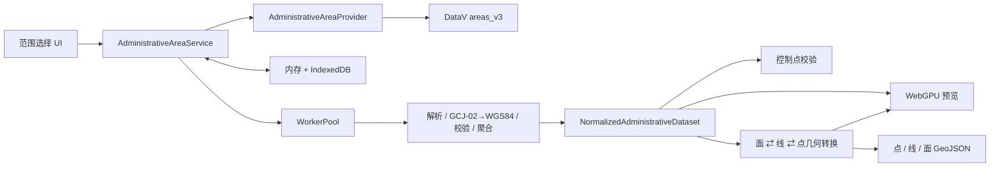

# GeoForge 行政区范围选择器：数据与转换设计

## 1. 数据流



`NormalizedAdministrativeDataset` 是预览、校验和导出的唯一事实来源。任何消费者不得重新请求边界、重复转换坐标或自行修补 Feature。

## 2. Provider 接口

```ts
export type AdministrativeLevel = 'country' | 'province' | 'city' | 'district';
export type CoordinateReference = 'GCJ02' | 'WGS84';

export interface AdministrativeAreaRecord {
  adcode: string;
  name: string;
  level: AdministrativeLevel;
  parentAdcode: string | null;
  center?: [number, number];
  childrenCount?: number;
}

export interface ProviderMetadata {
  id: string;
  datasetVersion: string;
  coordinateReference: CoordinateReference;
  sourceUrl: string;
  sourceUpdatedAt?: string;
  fetchedAt: string;
}

export interface BoundaryQuery {
  adcode: string;
  includeChildren: boolean;
}

export interface ProviderBoundaryResult {
  metadata: ProviderMetadata;
  features: GeoJSON.Feature<GeoJSON.Polygon | GeoJSON.MultiPolygon>[];
}

export interface AdministrativeAreaProvider {
  readonly id: string;
  getMetadata(signal?: AbortSignal): Promise<ProviderMetadata>;
  getCatalog(signal?: AbortSignal): Promise<AdministrativeAreaRecord[]>;
  getBoundary(query: BoundaryQuery, signal?: AbortSignal): Promise<ProviderBoundaryResult>;
}
```

业务服务不得拼接 DataV URL，也不得读取 DataV 特有字段。新增本地文件、后端代理或其他数据源时，只实现该接口。

## 3. DataV `areas_v3` 适配

首个适配器使用以下资源模型：

- `bound/all.json`：行政区目录，建立搜索索引与父子树；
- `{adcode}.json`：行政区自身边界；
- `{adcode}_full.json`：直接子级边界；
- `_full_city` 等非稳定扩展端点不进入公共接口，除非适配器通过能力探测确认并有回退路径。

适配器负责：

1. 将 DataV 的 `adcode/name/level/parent/lng/lat` 映射为统一记录；
2. 把无父级、空字符串和特殊层级规范化；
3. 验证响应确为 FeatureCollection，且每个边界为 Polygon/MultiPolygon；
4. 将数据坐标系声明为 GCJ-02；
5. 记录 `areas_v3`、响应头中的更新时间（若存在）和实际获取时间；
6. 对 CORS、404、非 JSON 和结构变化返回稳定错误码。

DataV 的行政区数据来自高德体系且数据发布时间较早，页面和导出元数据必须显示来源与更新时间，并明确“适合数据可视化，不作为法定行政界线或测绘成果”。

## 4. 行政层级与特殊区域

目录树是唯一层级依据。禁止使用 `adcode.slice(...)` 推断父子关系，因为直辖市和特殊区域可能没有普通的省—市—区链。

- 普通省：省→市→区县；
- 直辖市：Provider 若返回省级节点直接挂区县，则 UI 和聚合直接使用该关系；
- 香港、澳门、台湾：展示 Provider 实际提供的层级和边界，不生成不存在的子级；
- 无子级区域：只允许导出自身；
- Provider 出现孤儿节点或循环父链：目录校验失败，相关节点不可选择，记录 `AREA_CATALOG_INVALID`。

聚合目标通过从当前节点向下遍历 `parentAdcode` 图得到。每个期望节点必须有且仅有一个 Feature；重复、遗漏或层级错误都会令聚合状态变为 `partial`。

## 5. 标准化数据模型

```ts
export type BoundaryFeatureMode = 'point' | 'line' | 'polygon';
export type DatasetCompleteness = 'complete' | 'partial' | 'invalid';

export interface AdministrativeFeatureProperties {
  adcode: string;
  name: string;
  level: AdministrativeLevel;
  parentAdcode: string | null;
  sourceProvider: string;
  sourceVersion: string;
  sourceCrs: CoordinateReference;
  outputCrs: 'WGS84';
  sourceGeometryType: 'Polygon' | 'MultiPolygon';
}

export interface BoundaryTopologyProperties extends AdministrativeFeatureProperties {
  sourceFeatureId: string;
  partIndex: number;
  partCount: number;
  ringIndex: number;
  ringCount: number;
  ringRole: 'outer' | 'hole';
  closed: boolean;
  vertexIndex?: number;
  ringVertexCount?: number;
}

export interface NormalizedAdministrativeDataset {
  selection: AdministrativeAreaRecord;
  targetLevel: AdministrativeLevel;
  expectedAdcodes: string[];
  metadata: ProviderMetadata;
  completeness: DatasetCompleteness;
  missingAdcodes: string[];
  rawPolygonFeatures: GeoJSON.Feature<GeoJSON.Polygon | GeoJSON.MultiPolygon>[];
  wgs84PolygonFeatures: GeoJSON.Feature<GeoJSON.Polygon | GeoJSON.MultiPolygon>[];
  bboxWgs84: [number, number, number, number];
  preparedAt: string;
}
```

原始和 WGS84 Feature 使用一致的 `feature.id = adcode` 和属性，便于叠加、拾取与对比。数据集对象在完成后视为不可变；切换选择产生新对象，避免异步任务覆盖当前状态。

## 6. 解析、转换与几何校验

处理全部放入 Worker，顺序固定为：

1. JSON 解析和输入大小限制；
2. FeatureCollection、属性和几何类型验证；
3. 坐标有限值、经纬度范围、环最少四点及首尾闭合检查；
4. 克隆原始面数据；
5. 按 Provider 坐标系递归转换所有环坐标；目录中心点可单独转换用于地图定位，但不得进入边界点 Feature；
6. 再次检查范围、闭合、空环和退化环；
7. 计算 WGS84 bbox、环拓扑索引和空间索引；
8. 按期望 adcode 集合判定完整性。

DataV 适配器使用 L0 的 `gcj02ToWgs84`。中国境外坐标应遵循该函数的 out-of-China 行为，不额外偏移。不得对同一个坐标重复转换；缓存键必须包含源坐标系和输出坐标系。

首期不自动修复自相交、跨日界线或严重损坏的面，以免静默改变行政边界。可安全修复的情况仅限补齐闭合点、移除连续重复点和规范化 `-0`；所有修复写入诊断信息。

## 7. 点、线、面双向转换

DataV 输入的权威边界只接受 Polygon/MultiPolygon。几何转换服务提供完整的六向接口：

```ts
export type BoundaryGeometry =
  | GeoJSON.Point
  | GeoJSON.LineString
  | GeoJSON.Polygon
  | GeoJSON.MultiPolygon;

export interface GeometryConversionRequest {
  sourceMode: BoundaryFeatureMode;
  targetMode: BoundaryFeatureMode;
  features: GeoJSON.FeatureCollection<BoundaryGeometry>;
}

export interface GeometryConversionResult {
  sourceMode: BoundaryFeatureMode;
  targetMode: BoundaryFeatureMode;
  features: GeoJSON.FeatureCollection<BoundaryGeometry>;
  sourceFeatureCount: number;
  outputFeatureCount: number;
  topologyVerified: boolean;
}

export interface BoundaryGeometryConverter {
  convert(request: GeometryConversionRequest, signal?: AbortSignal): Promise<GeometryConversionResult>;
}
```

### 7.1 面→线与线→点

- 面→线：每个 polygon part 的每个环产生一个 LineString Feature；`ringIndex = 0` 是外环，其余为孔洞环，并同时写入 `ringRole`；
- 线→点：每个非重复节点产生一个 Point Feature；闭合线末尾的重复首点不再产生 Point；
- Feature ID 固定为 `{adcode}:p{partIndex}:r{ringIndex}` 和 `{lineId}:v{vertexIndex}`，确保直接转换与链式转换结果一致；
- 原环中除闭合点以外的重复坐标不能按坐标去重，因为不同 `vertexIndex` 代表不同拓扑位置。

### 7.2 面→点

内部固定执行面→线→点，不另写一套顶点提取算法。这样面→点与用户显式执行两步转换的 Feature ID、顺序和属性完全一致。

### 7.3 点→线与线→面

- 点→线按 `sourceFeatureId/partIndex/ringIndex` 分组、按 `vertexIndex` 排序；序号必须连续且数量等于 `ringVertexCount`；
- `closed: true` 的点组在末尾追加首点；`closed: false` 保持开放线；
- 线→面只接受闭合环。每个 part 必须恰有一个 `outer` 环，零个或多个 `hole` 环；
- 一个 part 恢复 Polygon，多个 part 恢复 MultiPolygon；恢复后的 Feature ID 回到 `sourceFeatureId`；
- 属性冲突、缺少环、重复序号、开放线造面、孔洞无外环都返回结构化错误。

### 7.4 点→面和可逆保证

点→面固定执行点→线→面。工具生成的点/线因为携带完整 `BoundaryTopologyProperties`，必须满足：

```text
polygon → line → polygon = polygon
polygon → point → polygon = polygon
line → point → line = line
```

等价比较忽略 GeoJSON 对象键顺序，但必须保持坐标值、顶点顺序、环顺序、孔洞归属、Polygon/MultiPolygon 类型、Feature ID 和行政区属性。对外部任意散点或缺少拓扑属性的线，首期拒绝反向转换；不使用最近邻、凸包、凹包、缓冲区等推测方法。

## 8. 聚合与并发

- 目录先计算 `expectedAdcodes`，再发起边界请求；
- 同时请求数默认 4，支持 AbortSignal；
- 相同 URL 进行请求合并，多个消费者共享一个 Promise；
- 子请求失败可按指数退避重试两次；取消、4xx 结构性错误不重试；
- 任一子级最终失败时保留成功结果用于预览和诊断，但 `completeness = 'partial'`，不得导出；
- 重新尝试只请求缺失项，成功后重新生成不可变数据集。

## 9. 两级缓存

### 9.1 内存缓存

使用 LRU，保存当前目录、最近原始响应和标准化数据集。默认预算 64 MiB；超过预算优先淘汰非当前选择、最久未访问的数据。正在被页面使用或 Worker 处理的数据不能淘汰。

### 9.2 IndexedDB

数据库名 `gis-forge-area-selector-v1`，包含：

| Store | Key | Value |
| --- | --- | --- |
| `catalog` | `{provider}:{version}` | 目录、元数据、校验摘要 |
| `raw-boundaries` | `{provider}:{version}:{adcode}:{children}` | 原始响应与获取时间 |
| `normalized` | `{provider}:{version}:{adcode}:{children}:{sourceCrs}:WGS84:{algorithmVersion}` | 标准化权威面数据 |
| `converted-geometry` | `{datasetFingerprint}:{sourceMode}:{targetMode}:{topologyVersion}` | 点线面派生结果，可随时由权威面重建 |

默认有效期为 7 天；用户可手动刷新。版本、算法版本、坐标系或结构校验版本变化时自然产生新键，不覆盖旧键。读取损坏记录时删除该条并回源，不清空整个数据库。

## 10. GeoJSON 导出

导出器只接受 `completeness === 'complete'` 的标准化数据集。默认从 `wgs84PolygonFeatures` 转换到目标几何；公共转换器也支持将工具生成的点/线反向恢复后再导出：

```ts
export interface AreaExportOptions {
  mode: BoundaryFeatureMode;
  includeValidationSummary: boolean;
}

export interface AreaExportResult {
  fileName: string;
  mimeType: 'application/geo+json';
  featureCollection: GeoJSON.FeatureCollection;
}
```

点和线 Feature 必须保留完整 `BoundaryTopologyProperties`，否则导出结果不能声明为可逆。每个 Feature 保留统一行政区属性。顶层可增加非标准但合法的 `metadata` 成员，记录工具版本、Provider、数据版本、生成时间、输出坐标系、源/目标 Feature 模式、拓扑版本和校验摘要。GeoJSON 不写 `crs` 成员；依据 RFC 7946，输出坐标固定为 WGS84 经纬度。

## 11. 参考资料

- [阿里云 DataV 范围选择器功能介绍](https://help.aliyun.com/en/datav/datav-6-0/user-guide/introduction-to-range-selector-features)
- [DataV areas_v3 行政区目录](https://geo.datav.aliyun.com/areas_v3/bound/all.json)
- [RFC 7946：The GeoJSON Format](https://www.rfc-editor.org/rfc/rfc7946)

这些地址只属于 `DataVAdministrativeAreaProvider` 和设计依据；业务服务与 UI 不得直接依赖具体 URL。
