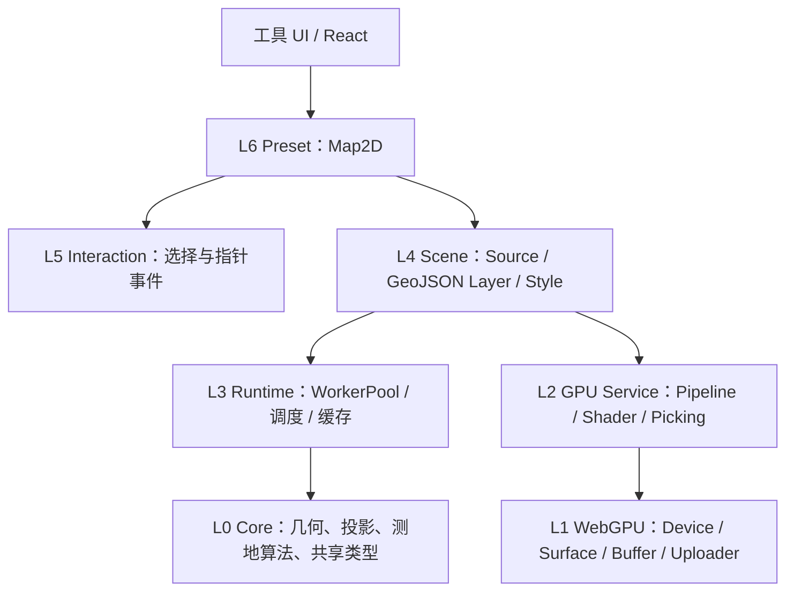

# GeoForge 行政区范围选择器：WebGPU 渲染设计

## 1. 设计原则

范围选择器复用 GeoForge 七层架构，不在 React 页面中直接创建 GPUDevice、Buffer、Pipeline 或 RenderPass。



当前代码中的 `GeoJSONLayer` 已有数据、更新和查询接口，但 GPU `encode` 与 `queryRenderedFeatures` 仍是占位路径；`Map2D` 对通用 GeoJSON Source/Layer 的接入也需补齐。实施目标是完善这些通用能力，而不是为行政区写一次性渲染器。

## 2. 图层组成

范围选择器固定创建以下图层，图层 ID 稳定：

| 顺序 | 图层 | 用途 | 拾取 |
| --- | --- | --- | --- |
| 0 | `area-basemap` | WGS84 语义的栅格底图 | 否 |
| 10 | `area-boundary-raw` | 原始边界，红色虚线、低透明度 | 否 |
| 20 | `area-boundary-wgs84-fill` | 转换后面填充，绿色低透明度 | 是 |
| 21 | `area-boundary-wgs84-line` | 转换后绿色实线 | 是 |
| 25 | `area-target-geometry` | 当前目标点/线/面 Feature 的预览 | 是 |
| 30 | `area-hover` | 悬停行政区 | 否，复用拾取结果 |
| 40 | `area-selected` | 当前选择描边和填充 | 否 |
| 50 | `area-control-point` | WGS84 控制点 | 否 |

原始边界仍按其数值坐标叠加到同一 WGS84 地图，用于直观看到坐标偏移；不能把原始边界先转换再标成“原始”。用户关闭校验叠加后，原始图层不编码、不进入渲染通道。`area-target-geometry` 展示面→线或面→点等几何转换结果；目标为面时直接复用 WGS84 面图层，避免重复绘制。目标几何层与红/绿边界的坐标系校验图层互不替代。

## 3. 通用 GeoJSON Source/Layer

`Map2D` 需要支持真实的 GeoJSON Source 注册、数据更新和 Layer 生命周期。行政区工具使用现有 `createGeoJSONLayer` 公共方向，不引入工具专属 Layer API。

建议的引擎公共行为：

```ts
map.addSource(sourceId, {
  type: 'geojson',
  data: featureCollection,
});

map.addLayer(createGeoJSONLayer({
  id: layerId,
  data: featureCollection,
  point: { /* WebGPU 点样式 */ },
  line: { /* WebGPU 线样式 */ },
  fill: { /* WebGPU 面样式 */ },
}));

await map.queryRenderedFeatures(screenPoint, { layers: [layerId] });
```

最终 `queryRenderedFeatures` 必须是异步 Promise，并统一返回 L0 `PickResult/Feature` 语义。`GeoJSONLayer` 当前同步占位签名在兼容期可保留为内部方法，但 Map2D 对外不能伪造同步 GPU readback。

## 4. 点、线、面 GPU 编码

### 4.1 Point/MultiPoint

- 面→点、线→点产生的每个边界顶点都是独立 Point Feature，并携带环与顶点顺序；
- 每个点编码为实例数据，由共享单位四边形或圆形顶点模板扩展；
- 位置采用局部瓦片/RTC 坐标，样式属性使用实例缓冲；
- 控制点采用独立样式，不参与行政区拾取；
- 批次键由 pipeline、blend、depth 和样式布局组成，不按 Feature 创建 Buffer。

### 4.2 LineString/MultiLineString

- CPU/Worker 将线扩展为适合 GPU 的三角带或段实例，支持至少 `butt/round` cap 和 `miter/bevel/round` join；
- 原始边界虚线通过累计线长属性和 Fragment Shader 实现，不拆成大量小段；
- 面→线后的每个外环/孔洞环是独立 LineString Feature，环首尾保持闭合，避免接缝；
- 线宽使用屏幕像素语义，缩放时保持可读性。

### 4.3 Polygon/MultiPolygon

- Worker 使用现有 L0 earcut 能力对外环和孔洞三角剖分；
- 填充与描边分别编码，孔洞不能被填充；
- MultiPolygon 的子面共享 Feature ID，拾取时返回同一行政区；
- 三角剖分失败时该 Feature 不进入填充通道，返回结构化错误并禁止将其用于完整导出。

地图展示可生成按缩放级别派生的简化几何，但标准化全精度数据始终保留在 CPU/缓存侧并用于下载与校验。

## 5. GPU Color-ID 拾取

- 仅可交互的 WGS84 行政区图层分配 Pick ID；
- 每帧正常渲染不执行 readback；只有点击或节流后的悬停请求才生成拾取通道；
- 使用 L2 `PickingEngine` 管理 ID 分配、离屏纹理、异步拷贝和结果映射；
- 读取点击点周围 3×3 像素，按中心距离、图层顺序和深度选择结果；
- 每个请求携带递增序号，晚返回的旧请求不得覆盖新选择；
- 数据更新或图层销毁时释放 ID 映射和拾取纹理。

拾取返回 `feature.id/adcode/layerId/sourceId`。React 层只消费行政区 ID，再从当前标准化数据集读取详情，不能依赖 GPU 回传完整属性。

## 6. 数据更新和资源生命周期

1. Source 接收新的不可变 FeatureCollection；
2. Worker 解析、切分几何并生成 transferable typed arrays；
3. L1 `BufferPool/Uploader` 分配或复用 GPU Buffer；
4. L2 `PipelineCache/ShaderAssembler` 获取管线；
5. Layer 原子替换渲染批次；旧批次在当前 GPU work 完成后释放；
6. 图层移除、工具卸载或 device lost 时调用显式 `destroy()`。

权威面增量更新以 `feature.id = adcode` 为键；派生线和点使用带 part/ring/vertex 序号的稳定 Feature ID。行政区切换或目标几何变化通常是批量替换，优先一次上传连续 Buffer；悬停和选择仅更新少量状态 Buffer，不重建几何。

## 7. 裁剪与性能策略

- 全国省级和单省区县可使用非瓦片化 GeoJSON；超过 10 万顶点或 8 MiB 处理后数据时启用现有 `geojson-vt` 分块；
- 使用 bbox/视锥裁剪跳过不可见批次；
- 解析、坐标系转换、点线面几何转换、简化、三角剖分和空间索引全部在 Worker；
- GPU 上传合并为少量大 Buffer，避免每 Feature 一个资源；
- 相同 `NormalizedAdministrativeDataset` 的渲染派生数据按数据指纹复用；
- 默认性能目标：桌面端交互期间主线程单次任务不超过 8ms，地图平移缩放目标 60fps，普通省级数据选择反馈在 100ms 内出现。

性能预算是验收门槛而非承诺网络耗时。网络和首次 Worker 处理分别计时并在开发统计中展示。

## 8. Map2D/Map25D 与降级

GeoJSON Layer 的坐标和 GPU 编码不得绑定特定相机，可由 Map2D 和 Map25D 复用；范围选择器页面固定创建 Map2D，不提供视图切换，也不接入 Globe3D。

WebGPU 不可用、设备初始化失败或 device lost 时：

- 页面进入 `gpu-unavailable`，清晰说明预览不可用；
- 不创建 Canvas 2D/SVG 边界回退；
- Provider、Worker、IndexedDB、搜索、数值校验和 GeoJSON 下载继续运行；
- device lost 后允许用户重新初始化预览，失败不影响已经准备好的数据集。
