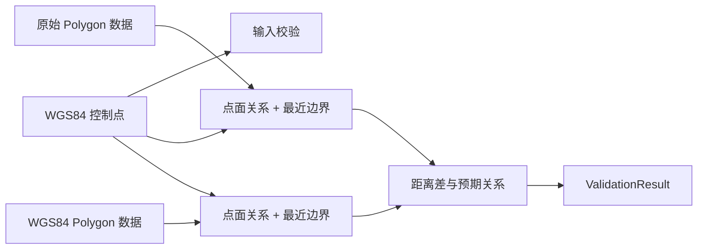

# GeoForge 行政区范围选择器：控制点校验设计

## 1. 校验目的

控制点校验回答三个问题：

1. 已知 WGS84 点与原始边界、转换后边界的相对位置分别是什么；
2. 点到两套边界的最近测地距离分别是多少；
3. 坐标转换后，边界与控制点的空间关系是否更符合用户给出的预期。

校验永远基于 Polygon/MultiPolygon 权威面数据。导出选择点、线或面只改变最终 GeoJSON 的几何形态，不改变校验数据或结果。本文“原始/转换后边界”特指 **GCJ-02→WGS84 坐标系转换**，不是面→线、线→点等几何转换。

即使当前预览或待下载数据是点/线，也直接使用同一 `NormalizedAdministrativeDataset.wgs84PolygonFeatures` 做点面判断；不需要先把点/线反向恢复为面。只有独立调用几何转换器验证点→面、线→面时，才使用拓扑元数据重建。

## 2. 输入与输出接口

```ts
export type ExpectedPointRelation = 'inside' | 'outside' | 'boundary' | 'unknown';
export type PointRelation = 'inside' | 'outside' | 'boundary';
export type ValidationStatus = 'pass' | 'warning' | 'fail' | 'indeterminate';

export interface Wgs84ControlPoint {
  id: string;
  name?: string;
  coordinates: [number, number];
  expectedRelation: ExpectedPointRelation;
  boundaryToleranceMeters: number;
}

export interface BoundaryPointMetrics {
  relation: PointRelation;
  nearestDistanceMeters: number;
  nearestPoint: [number, number];
  nearestFeatureAdcode: string;
  nearestRing: 'outer' | 'hole';
}

export interface ValidationResult {
  controlPoint: Wgs84ControlPoint;
  raw: BoundaryPointMetrics;
  converted: BoundaryPointMetrics;
  distanceDeltaMeters: number;
  improvementMeters: number;
  status: ValidationStatus;
  reasons: string[];
  datasetFingerprint: string;
  calculatedAt: string;
}
```

`distanceDeltaMeters = convertedDistance - rawDistance`；`improvementMeters = rawDistance - convertedDistance`。正的 improvement 表示转换后边界更接近控制点，但只有预期为“边界附近”时，该值才可直接用于位置偏差判断。

经度必须在 `[-180, 180]`，纬度必须在 `[-90, 90]`。边界容差允许 0.1–10,000 米，UI 默认 100 米且必须可见、可修改。

## 3. 计算流程



所有计算在 Worker 中执行：

1. 对每个 Feature 先做 bbox 排除；
2. 使用包含孔洞的点在面内算法判断 inside/outside；
3. 遍历 Polygon/MultiPolygon 的外环与孔洞环；
4. 对每个线段求球面/椭球近似上的最近点和测地距离；
5. 取全数据集最小值，并记录行政区、环类型和最近点；
6. 最近距离小于等于 `boundaryToleranceMeters` 时，关系归类为 `boundary`；
7. 使用相同过程分别计算原始数值边界和 WGS84 转换边界。

实现优先复用 L0 的 `pointInPolygon`、`nearestPointOnLine`、`karneyDistance/vincentyDistance` 等能力。平面算法只用于候选过滤；最终呈现的米制距离必须为测地距离。孔洞内部在拓扑上属于区域外，孔洞边缘属于边界。

## 4. 状态判定

### 4.1 无法判定 `indeterminate`

任一情况满足即无法判定：

- 控制点坐标或容差非法；
- 数据集不完整或没有面 Feature；
- 原始或转换几何无效，无法可靠执行包含测试；
- Worker 取消、超时或内部计算失败。

该状态不输出伪造的 0 米距离，也不能写成“校验通过”。

### 4.2 失败 `fail`

- 用户预期 `inside`，转换后关系为 `outside`；
- 用户预期 `outside`，转换后关系为 `inside`；
- 用户预期 `boundary`，转换后最近边界距离大于容差；
- 转换后产生越界坐标、空面或拓扑结构丢失。

`boundary` 关系可以满足用户预期 `inside` 或 `outside` 的边缘情况，但结果降级为 warning，避免边界容差造成误判。

### 4.3 通过 `pass`

- 预期为 `inside`，转换后为 `inside`；
- 预期为 `outside`，转换后为 `outside`；
- 预期为 `boundary`，转换后最近距离不超过容差。

如果同时满足预期但转换后距离较原始距离变差，不自动判失败：对于普通内部点，离边界更远可能完全正确。界面仍突出显示距离变化供人工判断。

### 4.4 警告 `warning`

- 预期为 `unknown`，系统只能提供客观指标，不能判断对错；
- 预期 inside/outside，但转换后落入边界容差区；
- 预期不是 boundary 且控制点距边界超过 5km：关系可验证，但该点不适合评估转换偏差；
- 结果满足预期，但原始与转换边界差异小于数据自身精度，无法据此证明转换准确。

判定优先级为 `indeterminate > fail > warning > pass`。

## 5. 可视化规范

| 对象 | 样式 | 说明 |
| --- | --- | --- |
| 原始边界 | 红色 2px 虚线，填充透明度 0.06 | 按原始坐标数值直接叠加 |
| WGS84 边界 | 绿色 2px 实线，填充透明度 0.10 | 与下载面数据一致 |
| 控制点 | 黄色实心圆、深色描边、外圈脉冲 | 始终位于顶层 |
| 原始最近点连线 | 红色细虚线 | 从控制点连到原始最近边界点 |
| 转换后最近点连线 | 绿色细实线 | 从控制点连到转换后最近边界点 |

地图图例不可省略，原始和转换图层可单独开关。缩放到控制点与两套最近点的联合 bbox，但不得自动改变控制点坐标。

## 6. 结果面板

结果至少展示：

- 控制点名称、经度、纬度、预期关系和容差；
- 原始边界：inside/outside/boundary、最近距离、最近行政区；
- 转换后边界：inside/outside/boundary、最近距离、最近行政区；
- `distanceDeltaMeters` 与 `improvementMeters`；
- 判定状态、全部原因、数据版本和计算时间；
- 一键复制 JSON 摘要。

距离小于 1,000m 显示米并保留 1 位小数；大于等于 1,000m 显示公里并保留 3 位小数。内部计算保留双精度，不使用格式化值参与判定。

## 7. 数据一致性与限制

- `ValidationResult.datasetFingerprint` 必须等于当前标准化数据集指纹；选择或刷新数据后，旧结果立即标记过期；
- 校验结果可写入导出顶层 metadata，但不得修改行政区 Feature；
- 一个普通内部控制点只能验证拓扑关系，不能证明边界偏移量正确；
- 靠近已知边界、且带有明确容差的控制点才适合比较转换前后位置误差；
- DataV 边界存在简化、时效和来源精度限制，数值结果不等于法定界线或测量成果。
